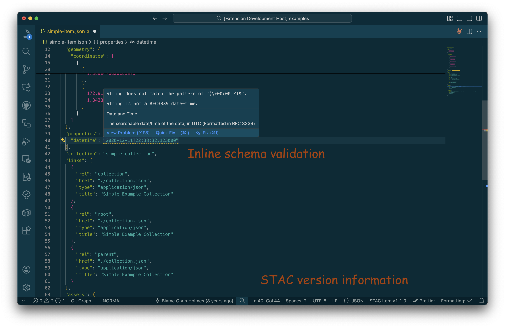

# Visual Studio Code STAC Validator

A Visual Studio Code extension that automatically configures JSON schema validation for [STAC (SpatioTemporal Asset Catalog)](https://stacspec.org/) JSON.

## How it works

This extension automatically validates your STAC JSON files against their corresponding JSON schemas.
When you open a STAC file (Item, Collection, or Catalog), the extension:

1. Detects the STAC type and version from the JSON content
2. Determines the appropriate JSON schema URL
3. Modifies your workspace settings to associate the file with its schema

The extension updates the `json.schemas` configuration in your workspace settings (`.vscode/settings.json`) to map your STAC files to their official schemas.
