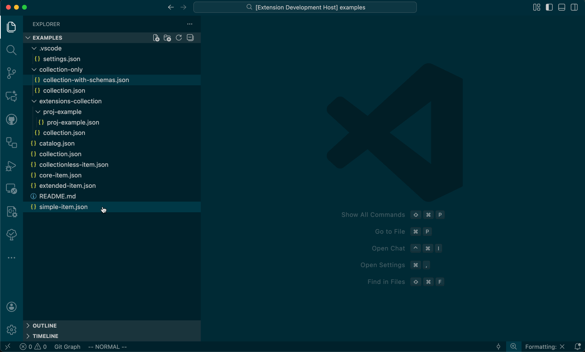

# Visual Studio Code STAC Validator

A Visual Studio Code extension that automatically configures JSON schema validation for [STAC (SpatioTemporal Asset Catalog)](https://stacspec.org/) JSON.

## How it works

This extension automatically validates your STAC JSON files against their corresponding JSON schemas and (optionally) extensions.
When you open a STAC file (Item, Collection, or Catalog), we:

1. Detect the STAC type and version
2. Modify your workspace settings to associate the file with its schema and its extensions (if enabled)

The extension updates the `json.schemas` configuration in your workspace settings (`.vscode/settings.json`).
